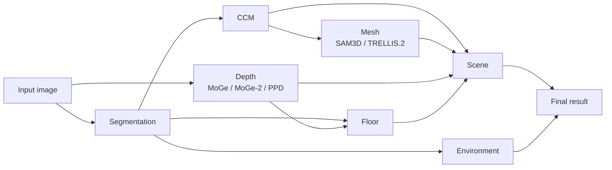

# Mira-Scene inference

[English](README.md) | [简体中文](README_zh-CN.md)

`infer_scripts/` is the recommended entry point for reconstructing 3D scenes
from one image or a flat image directory.



`environment` is an independent branch after segmentation. `scene` combines
the CCM, object meshes, depth, and floor estimation. The CCM-to-scene edge is
direct because scene construction reads canonical coordinate maps and point
clouds in addition to the generated meshes. `Final result` represents the
visual combination of scene geometry and the environment panorama; it is not
an additional pipeline stage.

Stages are resumable. The manifest tracks the concrete files and configuration
consumed by each stage, so an update reruns only its dependency-graph
descendants.

## Stages

| Stage | Purpose |
| --- | --- |
| `segmentation` | SAM3 instance/floor masks, object descriptions, and scene graph. |
| `depth` | Depth, camera-space points, intrinsics, validity mask, and FOV. |
| `ccm` | Canonical coordinate maps and voxel predictions. |
| `mesh` | Per-object meshes from SAM3D or TRELLIS.2. |
| `floor` | Floor plane, mesh, and optional texture. |
| `scene` | Object initialization and gravity/support-aware placement. |
| `environment` | Equirectangular environment map. |

## Environment setup

Different stages have incompatible Python/PyTorch/CUDA requirements. Follow
[docs/environment.md](docs/environment.md) to create the stage environments,
then create a local configuration:

```bash
cp infer_scripts/config/example.yaml infer_scripts/config/local.yaml
```

Replace the external repositories, checkpoints, APIs, and Python interpreters
in `local.yaml`. The relevant interpreter mapping is:

```yaml
environments:
  segmentation: {python: /path/to/mira-segmentation/bin/python}
  depth: {python: /path/to/mira-geometry/bin/python}
  ccm: {python: /path/to/mira-ccm/bin/python}
  mesh: {python: /path/to/mira-sam3d/bin/python}
  trellis2: {python: /path/to/mira-trellis2/bin/python}
  floor: {python: /path/to/mira-geometry/bin/python}
  scene: {python: /path/to/mira-geometry/bin/python}
  environment: {python: /path/to/mira-geometry/bin/python}
```

Checkpoint download commands and the configuration for each depth and mesh
backend are documented in [the environment guide](docs/environment.md#checkpoint-download-and-configuration).

## Interactive segmentation

Review masks, object identities, descriptions, floor masks, and support
relations in the SAM3 Web UI before running later stages:

```bash
python infer_scripts/0_segmentation.py \
  --web \
  --input /path/to/image_or_directory \
  --output /path/to/results \
  --config infer_scripts/config/local.yaml \
  --host 0.0.0.0 --port 8890
```

Open `http://SERVER_IP:8890`. Save the edited masks and scene graph after
review. Automatic non-interactive segmentation is also available by omitting
`--web`, but interactive review is recommended.

If `--output` already contains pipeline cases with `input/mask_*.png` and
`scene_graph.json` but no `review/annotation.json`, the web UI now imports
those existing masks and names instead of showing only the preview image.


### Bundled example cases

The repository includes prepared segmentation inputs under
[`example_cases/`](../example_cases/). Open all of them directly in the Web UI:

```bash
python infer_scripts/0_segmentation.py \
  --web \
  --output example_cases/cases \
  --config infer_scripts/config/local.yaml \
  --host 0.0.0.0 --port 8890
```

The example package intentionally omits generated depth, floor, and
environment outputs. To continue from its existing segmentation, run the
following independent branches. First generate depth and the pipeline floor
result:

```bash
python infer_scripts/pipeline.py \
  --input example_cases/images \
  --output example_cases/cases \
  --config infer_scripts/config/local.yaml \
  --from-stage depth --to-stage floor
```

Then generate the environment panorama. This uses the segmentation
`input/floor_mask.png`; it does not require the generated `floor/` directory:

```bash
python infer_scripts/pipeline.py \
  --input example_cases/images \
  --output example_cases/cases \
  --config infer_scripts/config/local.yaml \
  --from-stage environment --to-stage environment
```

This environment stage calls the configured image-generation API and requires
its API key. It does not rerun depth, CCM, mesh, floor, or scene.

Finally, run the CCM branch through scene construction:

```bash
python infer_scripts/pipeline.py \
  --input example_cases/images \
  --output example_cases/cases \
  --config infer_scripts/config/local.yaml \
  --mesh-backend sam3d \
  --from-stage ccm --to-stage scene
```

Keep the explicit `--from-stage` arguments when using these prepared cases.
Omitting `--from-stage` plans the complete pipeline, including segmentation,
and may replace the provided segmentation using the local configuration.

## Pipeline usage

When the complete pipeline is run below, it automatically executes segmentation
if no reusable segmentation outputs are present. Automatic segmentation can
miss objects, add false positives, or assign incorrect object names and support
relations, so its output should be reviewed before it is treated as final
annotation. We recommend opening the Web UI first, checking and saving the
masks, floor mask, object descriptions, and scene graph, and then running the
remaining pipeline stages.

Run the complete pipeline:

```bash
python infer_scripts/pipeline.py \
  --input /path/to/image_or_directory \
  --output /path/to/results \
  --config infer_scripts/config/local.yaml
```

Update one stage and the stages that depend on it:

```bash
# Rebuild the selected mesh backend and its scene only. Existing depth, CCM,
# floor, environment, and outputs from the other mesh backend are retained.
python infer_scripts/pipeline.py \
  --input /path/to/image_or_directory --output /path/to/results \
  --config infer_scripts/config/local.yaml \
  --from-stage mesh --force-stage mesh

# Rebuild scene construction only.
python infer_scripts/pipeline.py \
  --input /path/to/image_or_directory --output /path/to/results \
  --config infer_scripts/config/local.yaml \
  --from-stage scene --to-stage scene --force-stage scene
```

With an explicit `--from-stage`, the plan contains that stage and only its DAG
descendants. For example, `--from-stage depth` plans `depth`, `floor`, and
`scene`; `--from-stage mesh` plans `mesh` and `scene`. `--to-stage` is an upper
execution bound, so `--from-stage ccm --to-stage mesh` plans `ccm` and `mesh`.
Unrelated branches such as `environment` are left untouched. Omitting
`--from-stage` plans the complete pipeline and reuses compatible completed
stages, which is the usual way to continue after reviewing segmentation.

Select a mesh backend with `--mesh-backend sam3d|trellis2`. Configure the
depth backend in YAML:

```yaml
depth: {method: ppd, enable_metric: false}  # ppd, moge2, or moge
```

CCM and mesh support case-level GPU sharding:

```bash
python infer_scripts/pipeline.py \
  --input /path/to/images --output /path/to/results \
  --config infer_scripts/config/local.yaml --gpu-ids 0,1,2,3
```


## Output layout

```text
results/
├── pipeline_manifest.json
├── pipeline.log
└── <case>/
    ├── input/{source.png,scene.png,mask_000.png,...}
    ├── review/
    ├── scene_graph.json
    ├── depth/<method>/
    ├── CCM/
    ├── mesh/{sam3d,trellis2}/
    ├── floor/
    ├── scene/<backend>/<method>_depth/
    ├── environment/
    ├── logs/
    └── stage_manifest.json
```

For browsing generated results, continue to the
[visualization guide](../visualization/README.md).
