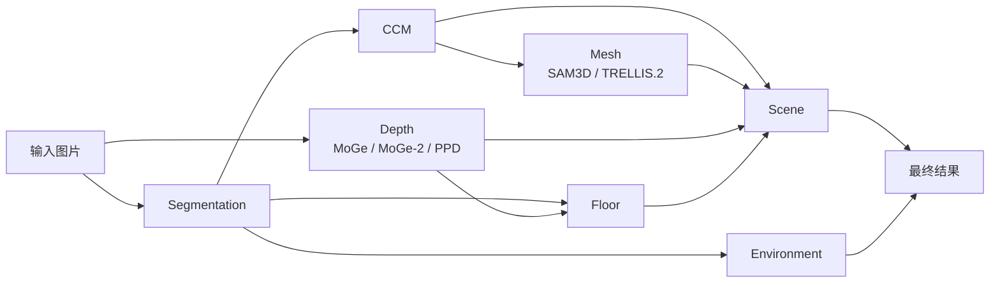
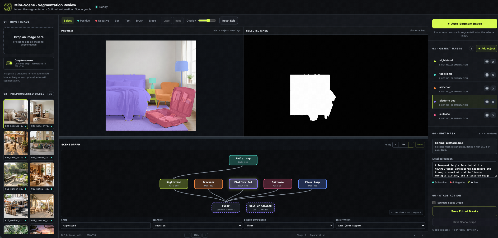

# Mira-Scene 推理

[English](README.md) | [简体中文](README_zh-CN.md)

`infer_scripts/` 是推荐的推理入口，可将单张图片或一个图片目录重建为 3D
场景。



`environment` 是 segmentation 之后的独立分支。`scene` 会综合使用 CCM、
物体 mesh、depth 和 floor 估计结果。CCM 需要直接指向 scene，因为 scene
构建除了使用生成的 mesh，还会直接读取 canonical coordinate map 和 point
cloud。`最终结果` 表示 scene geometry 与 environment panorama 的可视化组合，
不是额外的 pipeline stage。

所有阶段均支持断点复用。Manifest 会记录各阶段实际使用的文件和配置，因此更新
某一阶段时，只需重跑依赖图中受其影响的下游阶段。

## 阶段说明

| 阶段 | 作用 |
| --- | --- |
| `segmentation` | SAM3 实例/地面 mask、物体描述和场景图。 |
| `depth` | 深度、相机坐标点、内参、有效区域和视场角。 |
| `ccm` | Canonical Coordinate Map 与体素预测。 |
| `mesh` | 使用 SAM3D 或 TRELLIS.2 生成逐物体 mesh。 |
| `floor` | 估计地面并生成 mesh 和可选纹理。 |
| `scene` | 初始化物体，并进行重力与支撑关系优化。 |
| `environment` | 生成等距柱状环境图。 |

## 环境配置

不同阶段的 Python、PyTorch 和 CUDA 依赖并不完全兼容。按照
[环境配置文档](docs/environment_zh-CN.md) 创建各阶段环境，然后复制配置：

```bash
cp infer_scripts/config/example.yaml infer_scripts/config/local.yaml
```

在 `local.yaml` 中填写外部仓库、checkpoint、API 和 Python 解释器：

```yaml
environments:
  segmentation: {python: /path/to/mira-segmentation/bin/python}
  depth: {python: /path/to/mira-geometry/bin/python}
  ccm: {python: /path/to/mira-ccm/bin/python}
  mesh: {python: /path/to/mira-sam3d/bin/python}
  trellis2: {python: /path/to/mira-trellis2/bin/python}
  floor: {python: /path/to/mira-geometry/bin/python}
  scene: {python: /path/to/mira-geometry/bin/python}
  environment: {python: /path/to/mira-geometry/bin/python}
```

各 depth/mesh 后端的 checkpoint 下载命令和配置键见
[环境配置文档](docs/environment_zh-CN.md#checkpoint-下载与配置)。

## 交互式分割

建议先通过 SAM3 Web UI 检查实例 mask、物体名称与描述、地面 mask 和支撑
关系，再运行后续阶段：

```bash
python infer_scripts/0_segmentation.py \
  --web \
  --input /path/to/image_or_directory \
  --output /path/to/results \
  --config infer_scripts/config/local.yaml \
  --host 0.0.0.0 --port 8890
```

打开 `http://SERVER_IP:8890`，检查并保存编辑后的 mask 与 scene graph。
去掉 `--web` 可以进行全自动分割，但推荐进行人工检查。

如果 `--output` 里已有 pipeline 结果（`input/mask_*.png` 和 `scene_graph.json`），
但没有 `review/annotation.json`，网页会自动导入这些已有 mask 和物体名称，
而不是只显示预览图。



### 仓库示例

仓库在 [`example_cases/`](../example_cases/) 中提供了预处理好的 segmentation
输入。可以直接在 Web UI 中打开全部示例：

```bash
python infer_scripts/0_segmentation.py \
  --web \
  --output example_cases/cases \
  --config infer_scripts/config/local.yaml \
  --host 0.0.0.0 --port 8890
```

为控制仓库大小，示例包没有包含生成后的 depth、floor 和 environment 结果。若要
复用已有 segmentation，请分别运行下面几个独立分支。首先生成 depth 和 pipeline
的 floor 结果：

```bash
python infer_scripts/pipeline.py \
  --input example_cases/images \
  --output example_cases/cases \
  --config infer_scripts/config/local.yaml \
  --from-stage depth --to-stage floor
```

然后生成 environment panorama。该阶段使用 segmentation 已有的
`input/floor_mask.png`，不需要 `floor/` 目录中的 floor 生成结果：

```bash
python infer_scripts/pipeline.py \
  --input example_cases/images \
  --output example_cases/cases \
  --config infer_scripts/config/local.yaml \
  --from-stage environment --to-stage environment
```

该 environment 阶段会调用配置中的图像生成 API，因此需要相应的 API key；它不会
重新运行 depth、CCM、mesh、floor 或 scene。

最后从 CCM 运行至 scene 构建：

```bash
python infer_scripts/pipeline.py \
  --input example_cases/images \
  --output example_cases/cases \
  --config infer_scripts/config/local.yaml \
  --mesh-backend sam3d \
  --from-stage ccm --to-stage scene
```

使用这些预处理示例时请保留显式的 `--from-stage` 参数。不指定该参数会规划完整
pipeline，其中包含 segmentation，并可能按照本地配置替换示例提供的分割结果。

## Pipeline 用法

如果直接运行下面的完整流程，pipeline 会在缺少可复用 segmentation 结果时自动执行
分割。自动分割结果可能包含漏检、误检、物体名称或支撑关系错误，不能直接视为最终
标注。建议先启动 Web UI，人工检查并保存 mask、floor mask、物体描述和
scene graph，再运行后续 pipeline 阶段。

运行完整流程：

```bash
python infer_scripts/pipeline.py \
  --input /path/to/image_or_directory \
  --output /path/to/results \
  --config infer_scripts/config/local.yaml
```

更新某个阶段以及依赖它的阶段：

```bash
# 重建所选 mesh 后端及其 scene。已有的 depth、CCM、floor、environment
# 以及另一个 mesh 后端的输出均会保留。
python infer_scripts/pipeline.py \
  --input /path/to/image_or_directory --output /path/to/results \
  --config infer_scripts/config/local.yaml \
  --from-stage mesh --force-stage mesh

# 仅重新构建 scene。
python infer_scripts/pipeline.py \
  --input /path/to/image_or_directory --output /path/to/results \
  --config infer_scripts/config/local.yaml \
  --from-stage scene --to-stage scene --force-stage scene
```

显式指定 `--from-stage` 后，执行计划只包含该阶段及其 DAG 下游。例如，
`--from-stage depth` 会计划 `depth`、`floor`、`scene`；
`--from-stage mesh` 只会计划 `mesh`、`scene`。`--to-stage` 是执行顺序的
上限，因此 `--from-stage ccm --to-stage mesh` 只计划 `ccm` 和 `mesh`。
`environment` 等无关分支不会被修改。不指定 `--from-stage` 时会计划完整
pipeline，并自动复用 manifest 中兼容且已完成的阶段；通常可用这种方式从人工
检查后的 segmentation 继续执行。

通过 `--mesh-backend sam3d|trellis2` 选择 mesh 后端。深度后端在 YAML
中配置：

```yaml
depth: {method: ppd, enable_metric: false}  # ppd、moge2 或 moge
```

CCM 和 mesh 支持按 case 进行多卡分片：

```bash
python infer_scripts/pipeline.py \
  --input /path/to/images --output /path/to/results \
  --config infer_scripts/config/local.yaml --gpu-ids 0,1,2,3
```


## 输出目录

```text
results/
├── pipeline_manifest.json
├── pipeline.log
└── <case>/
    ├── input/{source.png,scene.png,mask_000.png,...}
    ├── review/
    ├── scene_graph.json
    ├── depth/<method>/
    ├── CCM/
    ├── mesh/{sam3d,trellis2}/
    ├── floor/
    ├── scene/<backend>/<method>_depth/
    ├── environment/
    ├── logs/
    └── stage_manifest.json
```

如需浏览生成结果，请继续查看[可视化指南](../visualization/README_zh-CN.md)。
