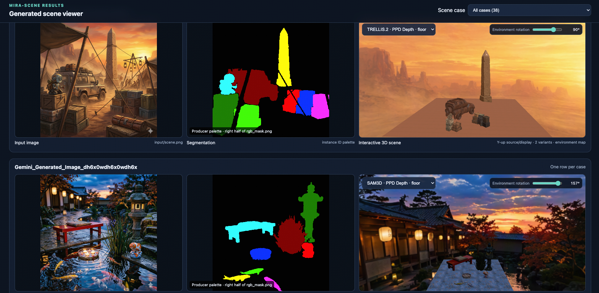

# Mira-Scene visualization

[English](README.md) | [简体中文](README_zh-CN.md)

This directory is a read-only Web viewer for Mira-Scene inference results.



## Start the server

Pass either a pipeline result root containing multiple cases or one case
directory:

```bash
python visualization/visualize_results.py /path/to/results --port 8000
```

The default bind address is `0.0.0.0`. The launcher prints both a loopback URL
and a best-effort server-IP URL:

```text
http://127.0.0.1:8000/
http://SERVER_IP:8000/
```

For local-only access:

```bash
python visualization/visualize_results.py /path/to/results \
  --host 127.0.0.1 --port 8000
```

A firewall, container port, Kubernetes Service, or SSH tunnel must separately
allow the selected port for remote access. This server has no authentication;
do not expose private results to an untrusted network.

## Viewer behavior

The Results page discovers files on every manifest request, so refreshing the
page also discovers newly completed pipeline cases. Each case row contains:

1. `input/scene.png`, falling back to `source.png` or `scene_fg.png`;
2. the instance-ID half of `CCM/rgb_mask.png` when available;
3. a click-to-load interactive GLB viewer.

The 3D selector discovers both current
`scene/<backend>/<depth>_depth/` and legacy `scene/<depth>_depth/` layouts. It
prefers `scene_with_floor.glb` and falls back to `scene.glb`. When
`environment/environment_equirect.*` exists, it is used for the visible
background and PBR environment lighting; the slider rotates it horizontally.

Images use `object-fit: contain` and share the 3D viewport height, so they are
scaled without cropping or distortion. 3D rendering is lazy and at most six
WebGL viewers remain active; loading another unloads the oldest viewer back to
a Load 3D button.

Click a loaded 3D viewport to activate its camera keyboard controls: `W/S`
moves forward/back, `A/D` moves left/right, and `Q/E` moves down/up. Hold
`Shift` for faster movement. Only the focused viewport responds.

## Supported result layout

```text
results/
└── <case>/
    ├── input/
    │   ├── scene.png
    │   └── source.png
    ├── CCM/rgb_mask.png
    ├── scene/
    │   └── <backend>/<method>_depth/
    │       ├── scene_with_floor.glb
    │       └── scene.glb
    └── environment/environment_equirect.png
```

Missing fields remain visible as `not available`; they do not collapse the
comparison grid.
